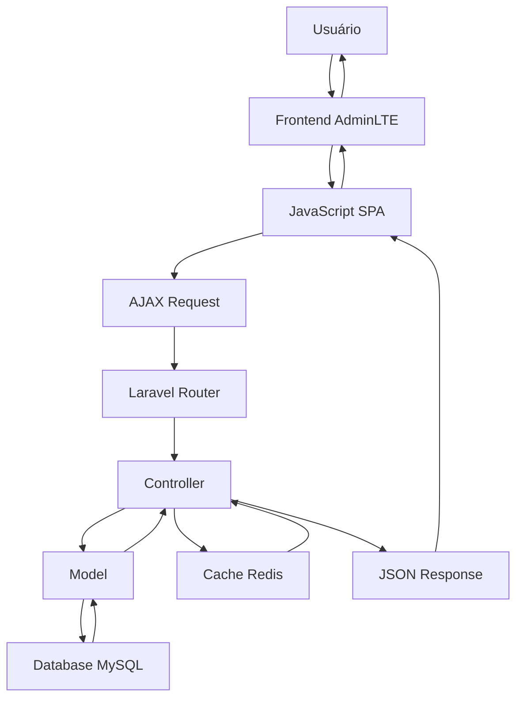

# Arquitetura SIGEP - Visão Geral

## 🏛️ Visão Geral do Sistema

O SIGEP (Sistema de Gestão Penitenciária) v2.0 é uma aplicação web completa para gestão penitenciária desenvolvida com Laravel 13.x e AdminLTE 4.

### 🎯 Objetivos Principais

- Gestão completa de unidades penitenciárias
- Controle de internos e movimentações
- Gestão de visitas e comunicações
- Relatórios e estatísticas em tempo real
- Autenticação e permissões granulares

### 🏗️ Arquitetura Técnica

```
┌─────────────────────────────────────────────────────────────┐
│                    Frontend (AdminLTE 4)                        │
├─────────────────────────────────────────────────────────────┤
│                    Application Layer (Laravel)               │
├─────────────────────────────────────────────────────────────┤
│                    Cache Layer (Redis + Predis)               │
├─────────────────────────────────────────────────────────────┤
│                    Database Layer (MySQL 8.0)                 │
└─────────────────────────────────────────────────────────────┘
```

### 🗂️ Estrutura de Diretórios

```
sigep_hml/
├── app/                          # Core Laravel
│   ├── Http/Controllers/        # Controllers (se necessário)
│   ├── Models/                   # Models Eloquent
│   └── Providers/               # Service Providers
├── modulos/                      # Módulos SIGEP (principal)
│   ├── Autenticacao/             # Sistema de autenticação
│   ├── Censura/                  # Controle de correspondências
│   ├── Eclusa/                   # Gestão de transferências
│   ├── Escolta/                  # Logística de deslocamentos
│   └── Coordenacao/              # Gestão administrativa
├── config/                       # Configurações Laravel
├── database/                     # Migrations e Seeds
├── resources/                    # Views e Assets
├── routes/                       # Rotas da aplicação
├── storage/                      # Armazenamento local
├── vendor/                       # Dependências Composer
└── docs/                         # Documentação
```

### 🔄 Fluxo de Arquitetura

#### 1. Navegação SPA (Single Page Application)
- **Entrada**: `index.php` → `routes/web.php`
- **Carregamento**: AJAX via `loadPage()`
- **Renderização**: Views AdminLTE sem refresh
- **Estado**: Mantido via JavaScript

#### 2. Sistema de Módulos
- **Estrutura**: `/modulos/[setor]/[nome]/`
- **Componentes**: View, Controller, Assets
- **Autoload**: Automático via Composer
- **Independência**: Cada módulo é autocontido

#### 3. Sistema de Permissões
- **Granularidade**: `modulo.recurso.acao`
- **Níveis**: 1-4 (Chefe > Gerente > Analista > Operador)
- **Armazenamento**: Banco de dados
- **Validação**: Em cada requisição

### 🔧 Componentes Principais

#### Frontend (AdminLTE 4)
- **Framework**: Bootstrap 5 + jQuery 3.6.0
- **Componentes**: Cards, Forms, Tables, Modals
- **Responsividade**: Mobile-first
- **Tema**: Customizado SIGEP

#### Backend (Laravel 13.x)
- **Framework**: Laravel 13.x
- **PHP**: 8.4.16
- **ORM**: Eloquent
- **Autenticação**: Laravel Fortify

#### Cache (Redis)
- **Cliente**: Predis (PHP puro)
- **Servidor**: Docker Ollama
- **Uso**: Sessões, cache, rate limiting
- **Performance**: Otimizado para alta carga

#### Banco (MySQL 8.0)
- **Charset**: utf8mb4_unicode_ci
- **Engine**: InnoDB
- **Relações**: Foreign keys ON DELETE RESTRICT
- **Índices**: Performance otimizada

### 🚀 Padrões de Projeto

#### MVC Tradicional com Modificações
- **Model**: Eloquent Models + Business Logic
- **View**: AdminLTE Components + JavaScript
- **Controller**: PHP Classes + AJAX Handlers

#### Padrão de Nomenclatura
- **Módulos**: `modulo_recurso_*`
- **Arquivos**: `[modulo]_[view|logica].php`
- **Classes**: `PascalCase` (PSR-4)
- **Métodos**: `camelCase`

#### Padrão de Segurança
- **Validação**: Server-side + Client-side
- **Sanitização**: PDO prepared statements
- **Autenticação**: Sessions + Tokens
- **Autorização**: Permissões granulares

### 📊 Fluxo de Dados



### 🔐 Modelo de Segurança

#### Camadas de Segurança
1. **Network**: Firewall + HTTPS
2. **Application**: Laravel Security
3. **Database**: MySQL Permissions
4. **Code**: Input Validation + Sanitization

#### Controle de Acesso
- **Autenticação**: Sessions + Fortify
- **Autorização**: Role-based + Resource-based
- **Auditoria**: Logs de acesso
- **Sessão**: Timeout + Redis

### 📈 Performance e Escalabilidade

#### Otimizações Implementadas
- **Cache**: Redis para dados frequentes
- **Database**: Índices otimizados
- **Frontend**: Lazy loading + Compression
- **Assets**: Minificação + CDN (produção)

#### Escalabilidade
- **Horizontal**: Load balancer + múltiplos servidores
- **Vertical**: More RAM + CPU + Storage
- **Database**: Read replicas + sharding
- **Cache**: Redis Cluster

### 🔄 Integração com Sistema Legado

#### Compatibilidade
- **Banco**: Migração gradual de dados
- **Funcionalidades**: Port incremental
- **Usuários**: Migração de credenciais
- **Processos**: Preservação de workflows

#### Estratégia de Migração
1. **Paralelismo**: Sistema novo + antigo
2. **Validação**: Testes intensivos
3. **Treinamento**: Usuários e suporte
4. **Corte**: Migração final

### 📱 Responsividade e Acessibilidade

#### Breakpoints
- **Mobile**: < 768px
- **Tablet**: 768px - 1024px
- **Desktop**: > 1024px

#### Acessibilidade
- **WCAG 2.1**: Nível AA
- **ARIA**: Labels e landmarks
- **Teclado**: Navegação completa
- **Contraste**: 4.5:1 mínimo

---

**Próximo**: [MVC + AdminLTE](mvc-adminlte.md)  
**Anterior**: [README](../README.md)